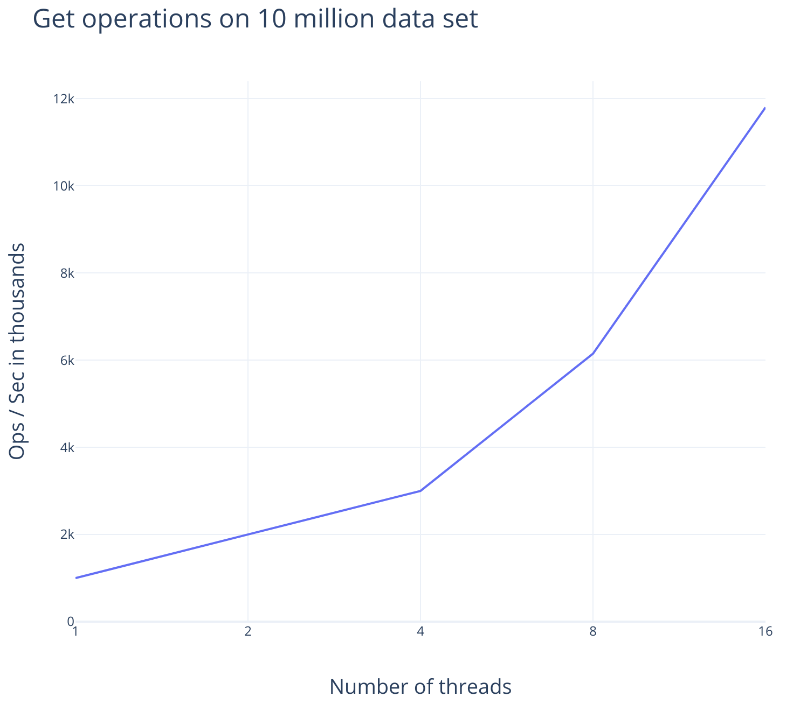
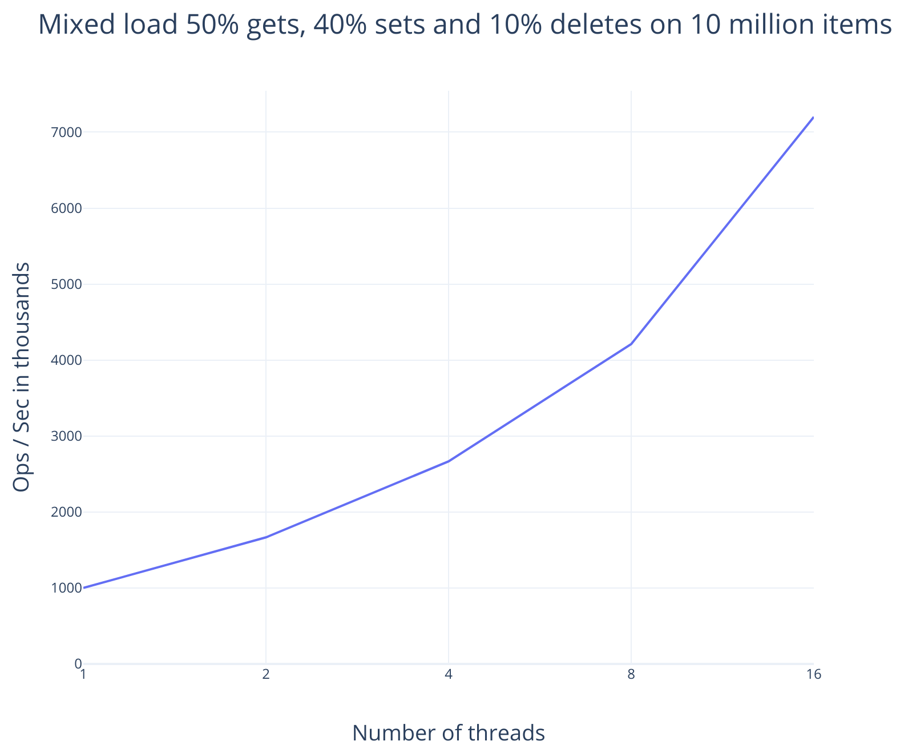

Concurrent Hash map
===================

Package implement Concurrent hash map.

Quoting from [Wikipedia][pds]:

> A data structure is *partially persistent* if all versions can be
> accessed but only the newest version can be modified. The data
> structure is *fully persistent* if every version can be both accessed
> and modified. If there is also a meld or merge operation that can
> create a new version from two previous versions, the data structure is
> called *confluently persistent*. Structures that are not persistent are
> called *ephemeral* data structures.

This implementation of hash map cannot be strictly classified into either
of the above definition. It supports concurrent writes, using atomic
Load, Store and Cas operations under the hood, and _does not_ provide
point in time snapshot for transactional operations or iterative operations.

If point in time snapshots are needed refer to [ppom][ppom] package, that
implement ordered map with multi-reader concurrency and serialised writes.

* [x] Each entry in [Map] instance correspond to a {Key, Value} pair.
* [x] Parametrised over `key-type` and `value-type`.
* [x] Parametrised over hash-builder for application defined hashing.
* [x] API - set(), get(), remove() using key.
* [x] Uses ownership model and borrow semantics to ensure safety.
* [x] Implement a custom epoch-based-garbage-collection to handle write
       concurrency and memory optimization.
* [x] No Durability guarantee.
* [x] Thread safe for both concurrent writes and concurrent reads.

Refer to [rustdoc](https://docs.rs/cmap) for details.

Performance
-----------

Machine: Gen-1 Thread-ripper 16/32 cores and 64GB RAM. All measurements use
32-bit key and 64-bit value and U32Hasher from cmap.

With 16 concurrent threads on a 10-million data set, cmap can perform
~12-million get operations.

 
 
 
 

Useful links
------------

* Wikipedia link on [hamt][hamt].
* Research paper on [ctrie][ctrie].
* Default hashing algorithm is [city-hash][city-hash].

Contribution
------------

* Simple workflow. Fork, modify and raise a pull request.
* Before making a PR,
  * Run `make build` to confirm all versions of build is passing with
    0 warnings and 0 errors.
  * Run `check.sh` with 0 warnings, 0 errors and all testcases passing.
  * Run `perf.sh` with 0 warnings, 0 errors and all testcases passing.
  * Run `cargo +nightly clippy --all-targets --all-features` to fix clippy issues.
  * [Install][spellcheck] and run `cargo spellcheck` to remove common spelling mistakes.
* [Developer certificate of origin][dco] is preferred.

[hamt]: https://en.wikipedia.org/wiki/Hash_array_mapped_trie
[ctrie]: http://aleksandar-prokopec.com/resources/docs/ctries-snapshot.pdf
[city-hash]: https://github.com/google/cityhash
[ppom]: https://github.com/bnclabs/ppom
[dco]: https://developercertificate.org/

